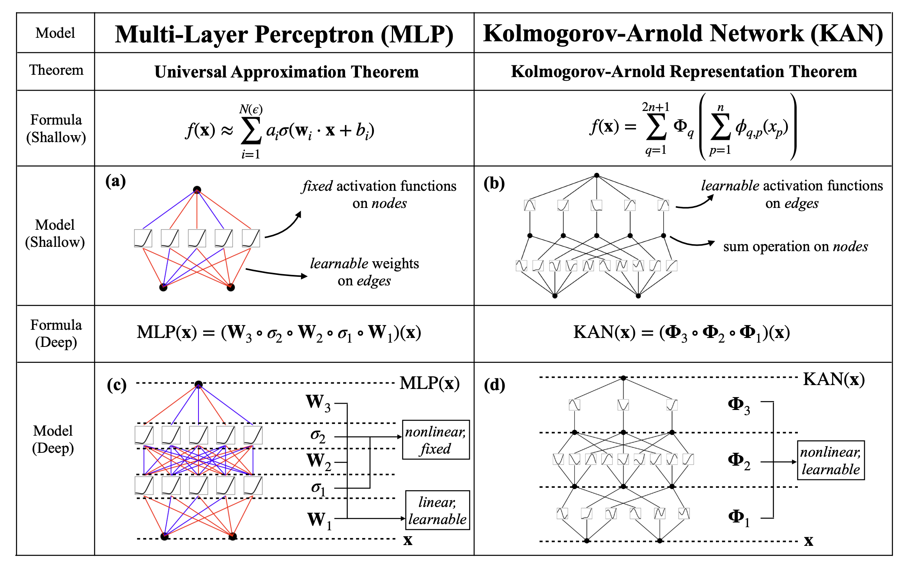

# Universal Approximation Theorem vs. Kolmogorov–Arnold Theorem

## [Universal approximation theorem](https://en.wikipedia.org/wiki/Universal_approximation_theorem)

The Universal Approximation Theorem states that a neural network with a single hidden layer containing a finite number of neurons can approximate continuous functions on compact subsets of Euclidean space, under certain conditions. Specifically, it asserts that such a network can approximate any continuous function with arbitrary accuracy given a sufficiently large number of neurons in the hidden layer.

Let $C(X, \mathbb{R}^m)$ denote the set of continuous functions from a subset $X$ of a Euclidean $\mathbb{R}^n$ space to a Euclidean space $\mathbb{R}^m$. If $\sigma \in C(\mathbb{R}, \mathbb{R})$, where $\sigma$ is not a polynomial function, then for every $n \in \mathbb{N}$, $m \in \mathbb{N}$, compact $K \subseteq \mathbb{R}^n$, $f \in C(K, \mathbb{R}^m)$, and $\varepsilon > 0$, there exist $k \in \mathbb{N}$, $A \in \mathbb{R}^{k \times n}$, $b \in \mathbb{R}^k$, and $C \in \mathbb{R}^{m \times k}$ such that

$$\sup_{x \in K} \|f(x) - g(x)\| < \varepsilon,$$

where $g(x) = C \cdot (\sigma \circ (A \cdot x + b))$.

## [Kolmogorov–Arnold Theorem](https://en.wikipedia.org/wiki/Kolmogorov%E2%80%93Arnold_representation_theorem)

The Kolmogorov-Arnold Representation Theorem, also known as the superposition theorem, asserts that any multivariate continuous function $f: [0,1]^n \rightarrow \mathbb{R}$ can be expressed as a finite composition of continuous functions of a single variable and the binary operation of addition. This theorem is a significant result in real analysis and approximation theory, providing insight into the structure of multivariate functions.

Specifically, if $f$ is a multivariate continuous function, it can be represented as:

$$f(\mathbf{x}) = f(x_1, \ldots, x_n) = \sum_{q=0}^{2n} \Phi_q\left(\sum_{p=1}^{n} \phi_{q,p}(x_p)\right),$$
where $\phi_{q,p}: [0,1] \rightarrow \mathbb{R}$ and $\Phi_q: \mathbb{R} \rightarrow \mathbb{R}$. Each $\phi_{q,p}$ represents a continuous function of one variable, and $\Phi_q$ represents a binary operation of addition.

The theorem's implications are far-reaching, demonstrating that complex multivariate functions can be decomposed into simpler components involving single-variable functions and addition operations. This result has applications in various areas of mathematics and has connections to Hilbert's thirteenth problem.
